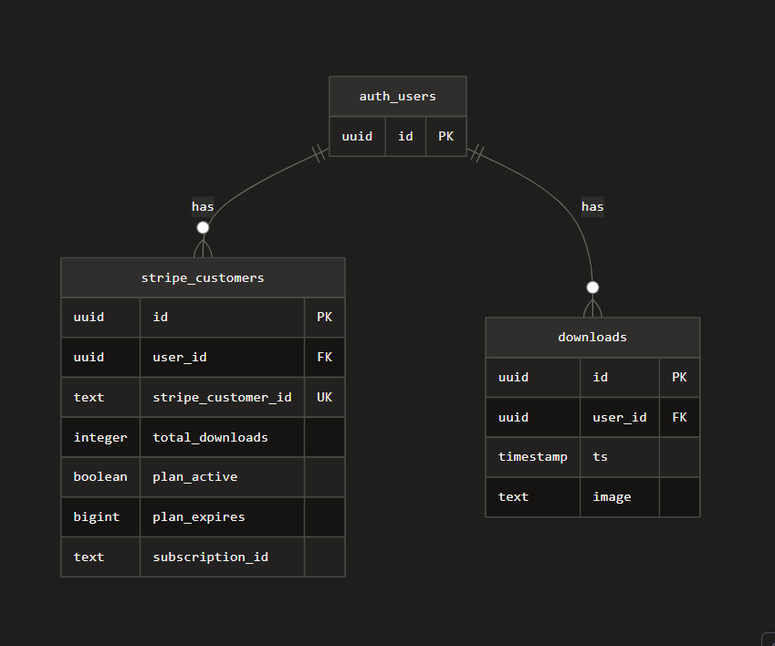

# Stripe SaaS Starter


## Overview

A modern SaaS starter template built with Next.js, Stripe for payments, TypeScript for type safety, and Supabase for backend services.

## Features

- 🚀 Built with Next.js 14 for optimal performance
- 💳 Stripe integration for seamless payment processing
- 🔐 Authentication and database powered by Supabase
- 📝 Full TypeScript support for type safety
- 🎨 Modern and responsive UI design
- ⚡ Fast and optimized for production

## Tech Stack

- **Framework**: Next.js 14
- **Language**: TypeScript
- **Payments**: Stripe
- **Backend**: Supabase
- **Styling**: Tailwind CSS

## Getting Started

### Prerequisites

- Node.js 18+ installed
- Stripe account
- Supabase account

### Installation

1. Clone the repository:

```bash
git clone <your-repo-url>
cd stripe-next-2025
```

2. Install dependencies:

```bash
npm install
# or
yarn install
# or
pnpm install
```

3. Set up environment variables:

```bash
cp .env.example .env.local
```

4. Add your environment variables:

```env
NEXT_PUBLIC_SUPABASE_URL=your_supabase_url
NEXT_PUBLIC_SUPABASE_ANON_KEY=your_supabase_anon_key
STRIPE_SECRET_KEY=your_stripe_secret_key
NEXT_PUBLIC_STRIPE_PUBLISHABLE_KEY=your_stripe_publishable_key
```

5. Run the development server:

```bash
npm run dev
# or
yarn dev
# or
pnpm dev
```

Open [http://localhost:3000](http://localhost:3000) to view it in your browser.

## Project Structure

```
├── app/                  # Next.js app directory
├── components/           # React components
├── lib/                  # Utility functions and configurations
├── public/              # Static assets
└── types/               # TypeScript type definitions
```

## Stripe Integration

This project includes:

- Payment processing
- Subscription management
- Webhook handling
- Customer portal

## Database Schema

### Entity Relationship Diagram



_Place your ERD image in the `docs` folder as `erd.png`_

### Supabase Setup

Configure your Supabase project with:

- Authentication providers
- Database tables
- Row Level Security (RLS) policies
- Storage buckets (if needed)

### Database Tables

Key tables in the database:

- **users**: User authentication and profile data
- **customers**: Stripe customer information
- **subscriptions**: Active subscription records
- **products**: Available products/plans
- **prices**: Pricing information for products

## Deployment

The easiest way to deploy is using [Vercel](https://vercel.com):

[](https://vercel.com/new/clone?repository-url=https://stripe-next-2025.vercel.app/)

## Learn More

- [Next.js Documentation](https://nextjs.org/docs)
- [Stripe Documentation](https://stripe.com/docs)
- [Supabase Documentation](https://supabase.com/docs)
- [TypeScript Documentation](https://www.typescriptlang.org/docs)

## License

MIT License - feel free to use this project for your own purposes.

## Support

For questions or issues, please open an issue on GitHub or contact the maintainers.

---

**Live Demo**: [https://stripe-next-2025.vercel.app/](https://stripe-next-2025.vercel.app/)
